> **ARM® Cortex®- M**

**32-bit Microcontroller**

**NuMicro® NuML Studio**

**User Manual**

*The information described in this document is the exclusive
intellectual property of  
Nuvoton Technology Corporation and shall not be reproduced without
permission from Nuvoton.*

*Nuvoton is providing this document only for reference purposes of
NuMicro microcontroller based system design. Nuvoton assumes no
responsibility for errors or omissions.*

*All data and specifications are subject to change without notice.*

For additional information or questions, please contact: Nuvoton
Technology Corporation.

[www.nuvoton.com](http://www.nuvoton.com)

***Table of Contents***

[Chapter 1:
Overview](#chapter-1-overview)
[4](#chapter-1-overview)

[Chapter 2:
Data Collection](#chapter-2-data-collection)
[5](#chapter-2-data-collection)

[2.1
Create Project](#21-create-project)
[5](#21-create-project)

[2.2
Sensor Data Collection](#22-sensor-data-collection)
[6](#22-sensor-data-collection)

[2.3
Audio Data Collection](#23-audio-data-collection)
[9](#23-audio-data-collection)

[2.4
Image Data Collection](#24-image-data-collection)
[9](#24-image-data-collection)

[2.5
Output Converting and Upload](#25-output-converting-and-upload)
[11](#25-output-converting-and-upload)

[Chapter 3:
Generate ML Model Project](#chapter-3-generate-ml-model-project)
[13](#chapter-3-generate-ml-model-project)

[3.1
LiteRT (TFLite) Deployment](#31-litert-tflite-deployment)
[13](#31-litert-tflite-deployment)

[3.2
Edge Impulse Deployment](#32-edge-impulse-deployment)
[14](#32-edge-impulse-deployment)

***List of Figures***

> [Figure 2.1-1 Project management
> page](#_Toc221026272) [5](#_Toc221026272)

> [Figure 2.1-2 Create project](#_Toc221026273)
> [6](#_Toc221026273)

> [Figure 2.1-3 Open project page](#_Toc221026274)
> [6](#_Toc221026274)

> [Figure 2.2-1 Connect the NuMaker to PC
> USB](#_Toc221026275) [7](#_Toc221026275)

> [Figure 2.2-2 Flash the data collection
> firmware](#_Toc221026276) [8](#_Toc221026276)

> [Figure 2.2-3 Collect the data](#_Toc221026277)
> [8](#_Toc221026277)

> [Figure 2.2-4 Reviewing Capture
> Data](#_Toc221026278) [9](#_Toc221026278)

> [Figure 2.4-1 Steps of image data
> collection](#_Toc221026279) [10](#_Toc221026279)

> [Figure 2.5-1 Output page](#_Toc221026280)
> [11](#_Toc221026280)

> [Figure 2.5-2 Upload page](#_Toc221026281)
> [12](#_Toc221026281)

> [Figure 3.1-1 LiteRT (TFLite) Deployment
> page](#_Toc221026282) [13](#_Toc221026282)

> [Figure 3.2-1 Edge Impulse deployment
> page (image classification example)](#_Toc221026283)
> [14](#_Toc221026283)

 

 

 

# Chapter 1: Overview

NuML Studio is a graphical user interface (GUI) tool designed to
simplify the development workflow of Machine Learning (ML) applications
for Nuvoton ML MCUs. It allows users to generate LiteRT for
Microcontrollers (TFLM) firmware projects, collect real-time sensor data
with Nuvoton ML MCU board, and interact with Edge Impulse without
requiring Python installation or additional software dependencies.

The tool provides an end-to-end environment—from data collection to
model deployment—tailored for Nuvoton’s NuMaker-M55M1 development board
and compatible ML firmware. These two modes are introduced in Chapters 2
and 3.

The NuML Studio repository is available on GitHub.

Please check the following link to get the latest update.

[https://github.com/OpenNuvoton/NuML_Studio/tree/main](https://github.com/OpenNuvoton/NuML_Studio/tree/main)

This tool focuses on data collection and model deployment. For the
Machine Learning (ML) process—such as data processing, training, and
testing—users can refer to Nuvoton NuEdgeWise for model training
examples. Third-party sources like Edge Impulse can also be used, or you
can import your own fully quantized int8 LiteRT (TFLite) model into this
tool.

[https://github.com/OpenNuvoton/NuEdgeWise](https://github.com/OpenNuvoton/NuEdgeWise)

 

 

 

# Chapter 2: Data Collection

## 2.1 Create Project

The first step in using NuML Studio is to create a project. You can
create a project for data collection, ML deployment firmware generation,
or both ([Figure 2.1-1](#_Toc221026272)).

Click the **“Choose”** button from **“Create Project”** to select a
directory, enter your project name, and then click **“Create This
Project”** to generate a new project ([Figure 2.1-2](#_Toc221026273)). NuML Studio creates a
folder in the specified path, and the project can be reopened later when
needed.

Before performing data collection, ensure that a project is opened. The
**“Open Project”** section allows you to open either the newly created
project or a previously saved one ([Figure 2.1-3](#_Toc221026274)).

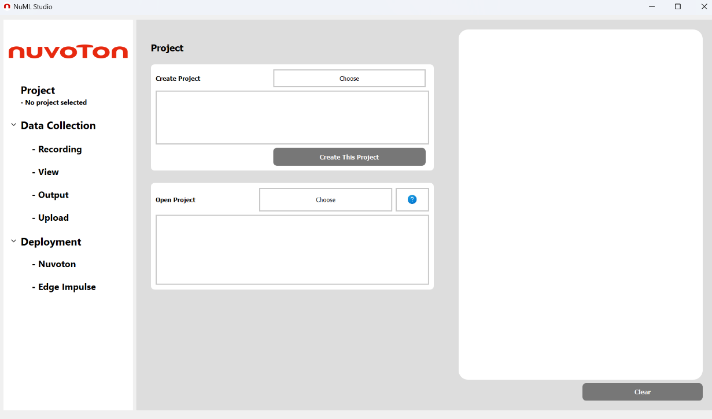

Figure 2.1-1 Project management page

 

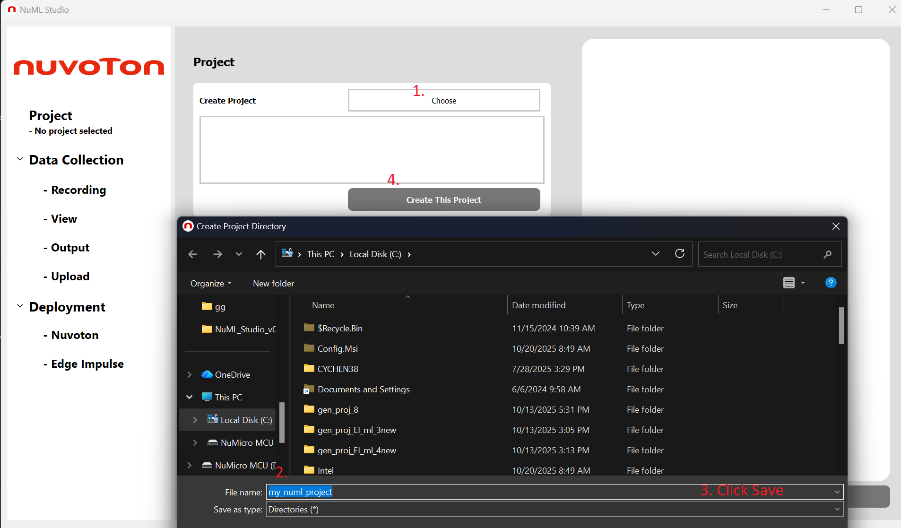

Figure 2.1-2 Create project

 

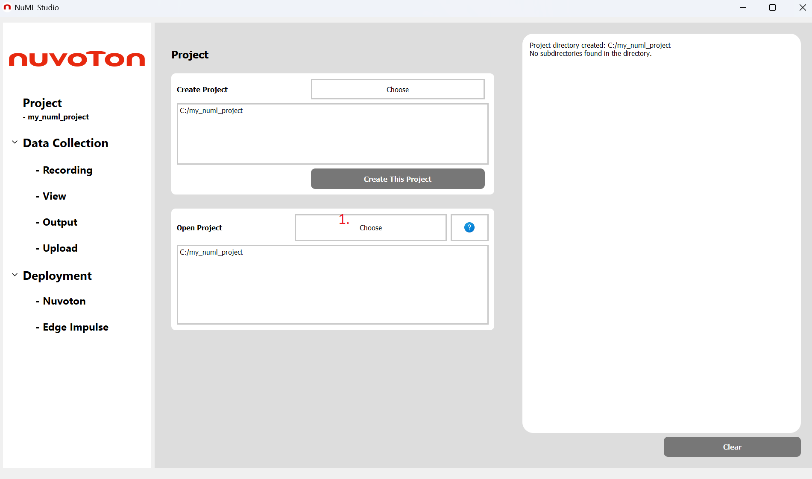

Figure 2.1-3 Open project page

## 2.2 Sensor Data Collection

For sensor data collection, NuML Studio uses the G-sensor (MPU-6500) on
the NuMaker-M55M1 board, which provides acceleration data along the X,
Y, and Z axes. The data is streamed to the PC via UART.

To begin, connect the NuMaker board to the PC using a USB cable ([Figure 2.2-1](#_Toc221026275)). Select **“G-sensor (X, Y, Z)”** under **“Data Type”**, and flash
the corresponding firmware to the NuMaker board ([Figure 2.2-2](#_Toc221026276)).

Next, select the correct serial port and specify a data label in
**“Label Folder Name”**. A folder with the same name as the label will
be automatically created in your project directory to store the
collected raw data.

Once the NuMaker board is successfully connected, the right-hand panel
will prompt you to click **“Button 1”** to start recording. Click the button
again to stop recording and save the raw data file (with the .sds
extension) in your project ([Figure 2.2-3](#_Toc221026277)). You may record data for as long
as needed, and click the button again to start a new recording session,
which will create a separate file.

After completing all data collection, disconnect the serial port to
release the connection between the PC and the NuMaker board. NuML Studio
will remain ready for continued use.

The corresponding collection firmware can be found at the following
path:

NuML_Studio\app\NuML_TFLM_Tool\templates\ML_M55M1_CMSIS_SDS\M55M1BSP-3.01.002\SampleCode\SDS\SDS_Recorder_gsensor_uart_CMSIS

NuML Studio also supports easy preview of time-series data files (with
the .sds extension), such as sensor and audio data introduced in Section
2.3.

To preview data, select **“View”** from the left-side tree panel, then
choose the corresponding YAML file that describes the collected data.
(For information on how to configure this file, refer to the
app/sds_utilities in NuML Studio GitHub repository.)

Finally, select the desired .sds file from your project’s Data
Collection folder to display the recorded data ([Figure 2.2-4](#_Toc221026278)).

 

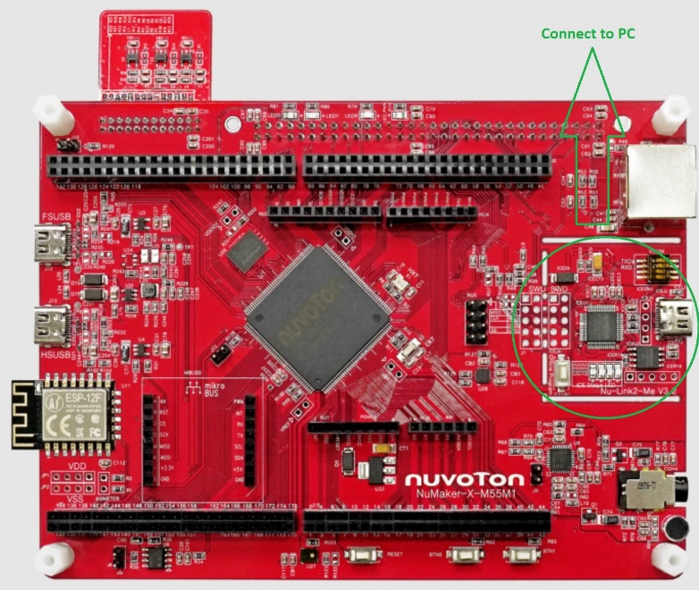

Figure 2.2-1 Connect the NuMaker to PC USB

 

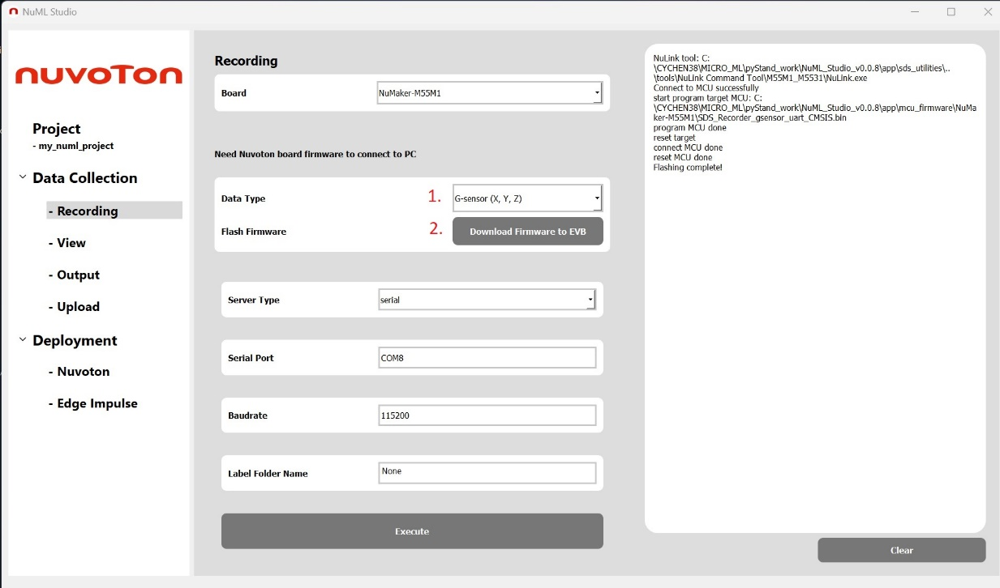

Figure 2.2-2 Flash the data collection firmware

 

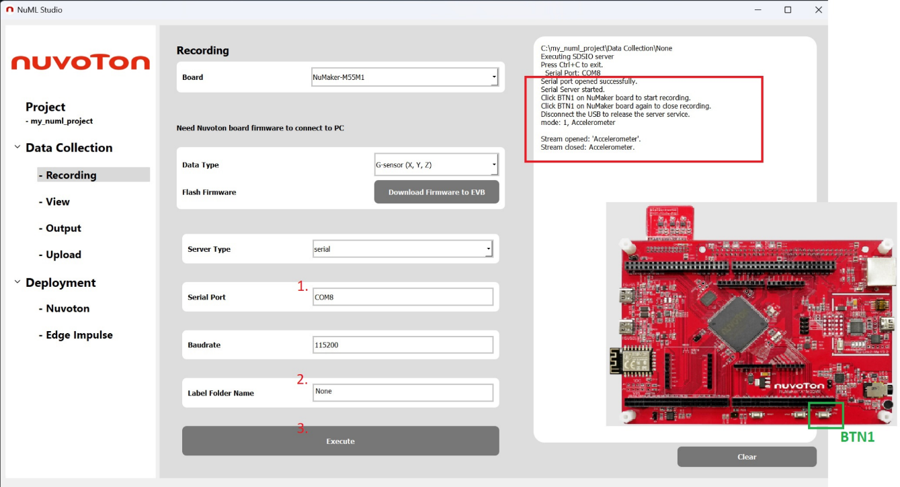

Figure 2.2-3 Collect the data

 

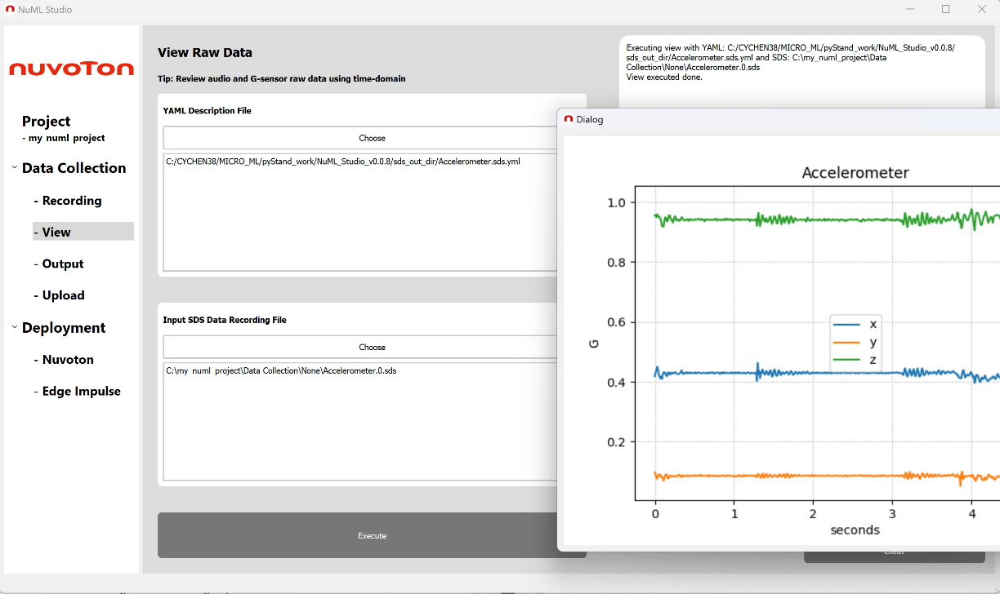

Figure 2.2-4 Reviewing Capture Data

## 2.3 Audio Data Collection

The process for audio data collection is the same as for sensor data
collection. All steps are identical except that you need to select
**“Audio (16 kHz)”** under **“Data Type”**.

The corresponding collection firmware can be found at the following
path:

NuML_Studio\app\NuML_TFLM_Tool\templates\ML_M55M1_CMSIS_SDS\M55M1BSP-3.01.002\SampleCode\SDS\SDS_Recorder_audio_uart_CMSIS

## 2.4 Image Data Collection

For image data collection, select **“Image”** under **“Data Type”** and
flash the corresponding firmware to the NuMaker board.

Next, specify a data label in **“Label Folder Name”**. A folder with the
same name as the label will be automatically created in your project
directory to store the collected image files in JPG format.

Then, connect the PC to the HSUSB port on the NuMaker board. Click the
**“Camera Enable”** button to open the camera preview window. This
preview supports both the NuMaker’s CCAP camera and the PC webcam.

After selecting the desired camera (NuMaker or PC) and the preferred
resolution, click **“Start”** to begin the camera preview. You can then
click the **“Raw Image Collection”** button at any time to capture and
save the current image to your project’s Data Collection folder.

The corresponding collection firmware can be found at the following
link:

[https://github.com/OpenNuvoton/M55M1BSP/tree/master/SampleCode/StdDriver/HSUSBD_Video_CAM](https://github.com/OpenNuvoton/M55M1BSP/tree/master/SampleCode/StdDriver/HSUSBD_Video_CAM)

 

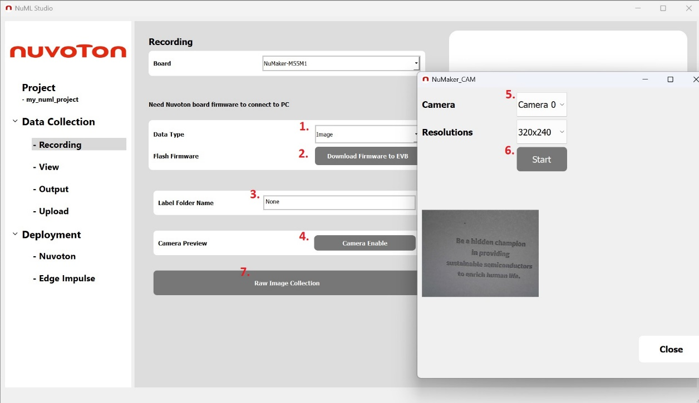

Figure 2.4-1 Steps of image data collection

## 2.5 Output Converting and Upload

After collecting sensor or audio raw data from Section 2.2 or 2.3, it is
necessary to convert the files into a more readable format, such as CSV
for sensor data or WAV for audio data. To begin, select **“Convert
Format”** based on your data type. If you are working with sensor data,
choose CSV; if you are working with audio data, choose WAV.

If the **“Edge Impulse Format & Export”** option is checked, the
converted data will be automatically uploaded to your Edge Impulse
project. (For more details, please refer to the Edge Impulse website.)
Before uploading, make sure that the Edge Impulse project API key has
been updated in the following file:

NuML_Studio/API_key.txt

Next, select the raw data file from the Input **“SDS Data Recording
File”** section, specify the desired output file name in the **“Output
File Name”** section, and select the corresponding YAML description file
from the **“YAML Description File”** section. If the **“Edge Impulse
Format & Export”** option is enabled, the label information will be
included in the Edge Impulse dataset by adding the label name as a
prefix to the original data file.

Finally, click the **“Execute”** button to generate the output file. If
Edge Impulse export is selected, the data will be automatically uploaded
to the linked Edge Impulse project ([Figure 2.5-1](#_Toc221026280)).

NuML Studio also supports uploading an entire data folder to Edge
Impulse. Simply select the folder that contains your collected data,
such as sensor CSV files, audio WAV files, or image files. Other file
types in the folder will be ignored during the upload process.

You can choose to upload the data to either the training or testing
dataset of your Edge Impulse project by selecting the desired option
under **“Category”**. To label all the files in the folder, enter the
label name in the **“Label”** text box before starting the upload ([Figure 2.5-2](#_Toc221026281)).

 

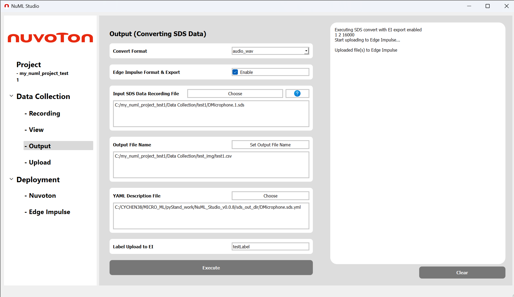

Figure 2.5-1 Output page

 

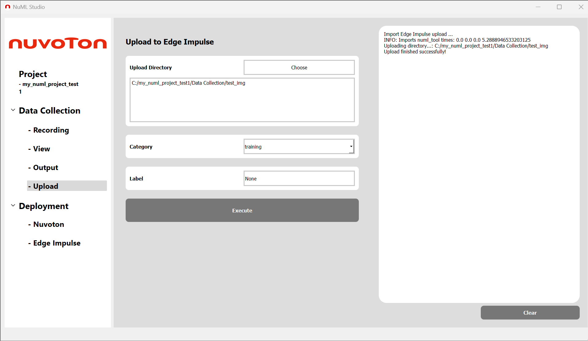

Figure 2.5-2 Upload page

 

 

 

# Chapter 3: Generate ML Model Project

In machine learning, deployment refers to the process of porting an ML
model to run on a real device. One of the key functions of NuML Studio
is to help users deploy their own models, either as a TFLite int8
quantization model or as an Edge Impulse deployment package.

The primary purpose of NuML Studio’s deployment feature is to generate
model inference code that runs on the NuMaker platform. It also provides
several general example applications. Example applications include
support for CCAP, DMIC, sensor, and other peripheral drivers. Example
projects include real-time keyword spotting (KWS), image classification
with live image preview and so on.

## 3.1 LiteRT (TFLite) Deployment

Users can convert an int8 quantized LiteRT (TFLite) model into a
ready-to-run inference project for NuMaker by selecting **“Deployment” →
“Nuvoton”** from the left-side tree panel ([Figure 3.1-1](#_Toc221026282)).

First, select the TFLite model file from the **“TFLite Model File”**
section. Then, choose the desired **“Project Type”**. Currently, NuML
Studio supports two build environments: ARM VS Code CMSIS solution and
ARM Keil µVision.

Under the **“Application”** section, NuML Studio provides several
example templates, including Model Inference, G-sensor, Image
Classification, and Object Detection (YOLOv8-nano). Users can select an
example that best fits their application and use it as a starting point
for developing their own machine learning project.

For the NuMaker-M55M1 platform, the system automatically enables the
NPU, and the model must be compiled using the Vela compiler. Normally,
the tensor arena size is determined by Vela; however, advanced users can
manually adjust it in the **“Tensor Arena Size”** field if needed.

Once all settings are configured, NuML Studio will begin converting the
model and generating the corresponding inference example code. This
process may take a few minutes. The generated NuMaker firmware project
will be placed in the project directory you created at the beginning.

 

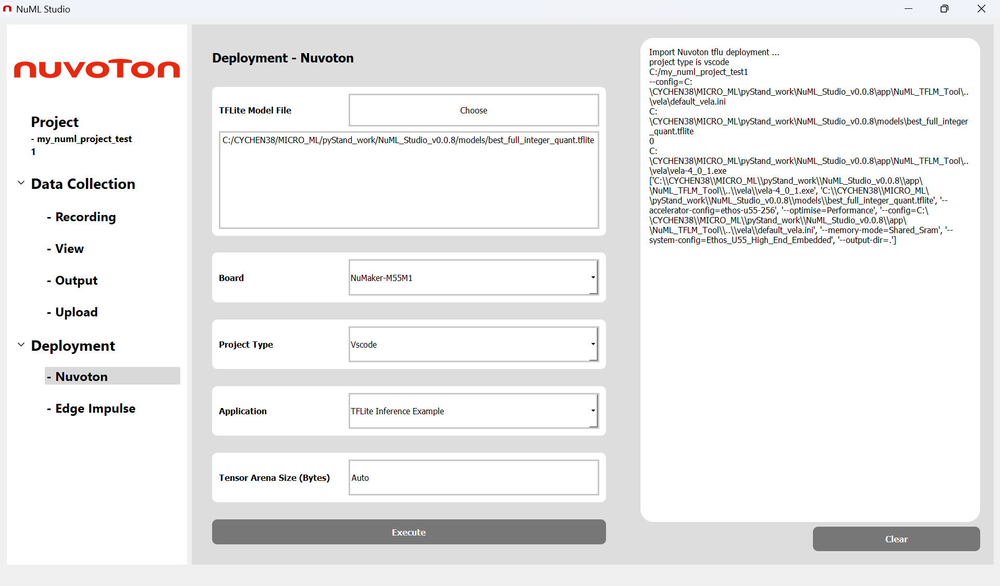

Figure 3.1-1 LiteRT (TFLite) Deployment page

## 3.2 Edge Impulse Deployment

NuML Studio also provides another deployment option—Edge Impulse—which
offers a complete end-to-end machine learning workflow in the cloud,
along with a deployment-ready C++ SDK. The SDK includes not only the
model inference code but also the necessary pre-processing and
post-processing functions. This feature helps users easily generate
firmware that can run their Edge Impulse project on NuMaker hardware.

A quick start guide on integrating with Edge Impulse and generating the
deployment package is available at:

[https://github.com/OpenNuvoton/NuML_Studio/blob/main/doc/QuickStart/QuickStart-EIProject.md](https://github.com/OpenNuvoton/NuML_Studio/blob/main/doc/QuickStart/QuickStart-EIProject.md)

The downloaded Edge Impulse deployment package is provided as a
compressed file. Unzip the file first, then navigate to **“Deployment” →
“Edge Impulse”** in NuML Studio and select your deployment folder in the
**“Download Edge Impulse SDK Path”** section ([Figure 3.2-1](#_Toc221026283)).

Before executing, make sure that the Edge Impulse project API key has
been updated in the following file:

NuML_Studio/API_key.txt

Similar to the LiteRT (TFLite) deployment, Edge Impulse deployment also
provides several **“Application”** options, including model inference,
keyword spotting (KWS), and image classification examples. The **“Test
Data Label”** field is used for validating the deployment firmware with
offline test data. By entering a classification label, NuML Studio will
automatically download the corresponding test data to help users verify
whether the model’s inference behavior matches the expected results.

Once all settings are configured, NuML Studio will start generating the
inference example code integrated with the Edge Impulse SDK. This
process may take a few minutes. The generated NuMaker firmware project
will be saved in the project directory created earlier.

 

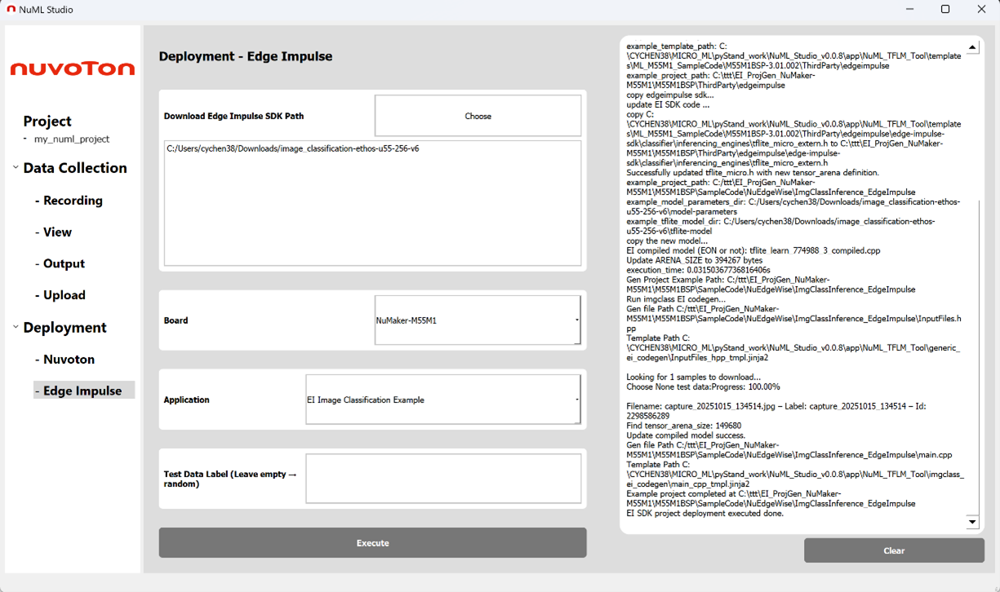

Figure 3.2-1 Edge Impulse deployment page (image classification example)

 

 

 

**Important Notice**

**Using this software indicates your acceptance of the disclaimer
hereunder:**

**THIS SOFTWARE IS FOR YOUR REFERENCE ONLY AND PROVIDED "AS IS" AND ANY
EXPRESS OR IMPLIED WARRANTIES, INCLUDING, BUT NOT LIMITED TO, THE
IMPLIED WARRANTIES OF MERCHANTABILITY AND FITNESS FOR A PARTICULAR
PURPOSE ARE DISCLAIMED. YOUR USING THIS SOFTWARE/FIRMWARE IS BASED ON
YOUR OWN DISCRETION, IN NO EVENT SHALL THE COPYRIGHT OWNER OR PROVIDER
BE LIABLE TO ANY DIRECT, INDIRECT, INCIDENTAL, SPECIAL, EXEMPLARY, OR
CONSEQUENTIAL DAMAGES (INCLUDING, BUT NOT LIMITED TO, PROCUREMENT OF
SUBSTITUTE GOODS OR SERVICES; LOSS OF USE, DATA, OR PROFITS; OR BUSINESS
INTERRUPTION) HOWEVER CAUSED AND ON ANY THEORY OF LIABILITY, WHETHER IN
CONTRACT, STRICT LIABILITY, OR TORT (INCLUDING NEGLIGENCE OR OTHERWISE)
ARISING IN ANY WAY OUT OF THE USE OF THIS SOFTWARE, EVEN IF ADVISED OF
THE POSSIBILITY OF SUCH DAMAGE.**

